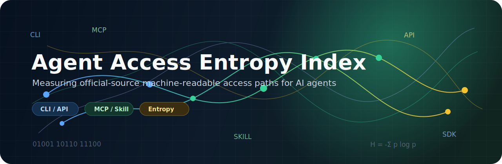

<p align="center">
  
</p>

# Agent Access Entropy Index

[](LICENSE)


[English](README.md) | 中文

信息熵是AI时代的第一性原理

<!-- resource-stats:start -->
## 数据集概览

| 指标 | 数量 |
|---|---:|
| 可及性资源 | 202 |
| 平台 / 软件 | 147 |
| 行业 / 领域 | 45 |

主数据：`data/01-index.sqlite`。版本：`0.1.0`。
<!-- resource-stats:end -->

## 使用数据

查询主 SQLite 数据库：

```bash
sqlite3 data/01-index.sqlite \
  "SELECT platform_en, resource_formats, source_url FROM data_sources WHERE platform_en LIKE '%GitHub%' LIMIT 10;"
```

打开可读 CSV 导出：

| 文件 | 用途 |
|---|---|
| [`data/01-index.sqlite`](data/01-index.sqlite) | 主数据库，包含三张表：`data_sources`、`tracked_entities`、`schema_fields`。 |
| [`data/01-data-sources.zh-CN.csv`](data/01-data-sources.zh-CN.csv) | 中文可读的可及性资源导出。 |
| [`data/01-data-sources.en.csv`](data/01-data-sources.en.csv) | 英文可读的可及性资源导出。 |
| [`data/02-tracked-entities.zh-CN.csv`](data/02-tracked-entities.zh-CN.csv) | 中文可读的公司、平台、软件和公共数据源追踪表。 |
| [`data/02-tracked-entities.en.csv`](data/02-tracked-entities.en.csv) | 英文可读的公司、平台、软件和公共数据源追踪表。 |
| [`data/03-schema.csv`](data/03-schema.csv) | 三张 SQLite 表的 schema 导出。 |
| [`data/04-manifest.json`](data/04-manifest.json) | 版本、数量、生成文件和校验和。 |

更新 SQLite 后，刷新可读导出和 README 统计：

```bash
python3 scripts/export_formats.py
```

## 收录范围

- 官方来源的 CLI、MCP、Agent Skill、SDK、API、Plugin 和数据导出访问路径。
- 公开或可商业获得的数据资源，以及公开平台/专业软件，包括医疗和生物领域。
- 与官方站点、RSS/Atom、GitHub 组织/仓库、文档和公开页面联动的待追踪 entity 清单。
- [`data/09-candidates/`](data/09-candidates/) 下的预审候选结果。

不收录私有数据、患者级数据、PHI/PII、机构内部系统、非公开专有数据集。

## 定时追踪

本地运行追踪流程：

```bash
python3 scripts/discover_candidates.py
python3 scripts/review_candidates.py
python3 scripts/sync_tracking_status.py
```

系统会先生成候选，再按规则预审和 double check；确认官方来源、公开边界和机器可访问性之后，才进入 `data_sources`。

## Agent 访问

运行本地 stdio MCP server：

```bash
python3 mcp/server.py
```

MCP tools 包括 `search_platform`、`list_access_resources`、`filter_by_resource_type`、`list_official_mcp` 和 `industry_summary`。

## 文档

| 文档 | 说明 |
|---|---|
| [数据字典](docs/03-data-dictionary.md) | 三表 schema 和中英文 CSV 导出。 |
| [查询指南](docs/04-query-guide.md) | SQLite 和 MCP 查询示例。 |
| [候选追踪](docs/05-candidate-tracking.md) | 待追踪清单、候选审查和入库流程。 |
| [方法论](docs/01-methodology.md) | 访问路径定义和评分草案。 |
| [官方来源判定规则](docs/02-verification-policy.md) | 官方、部分确认、社区、未确认的判定规则。 |
| [贡献指南](docs/10-contributing.md) | 贡献说明。 |
| [免责声明](docs/11-disclaimer.md) | 法律、安全、金融、商标等免责声明。 |

## 安全提示

被收录项目可能会执行命令、访问私有文件、调用外部服务、读写业务数据、触发支付、下单交易、转账数字货币或签署链上交易。使用前请审查代码和权限，优先使用只读凭证，并对不可逆操作保留人工确认。

## 许可证

MIT License。详见 [LICENSE](LICENSE)。
